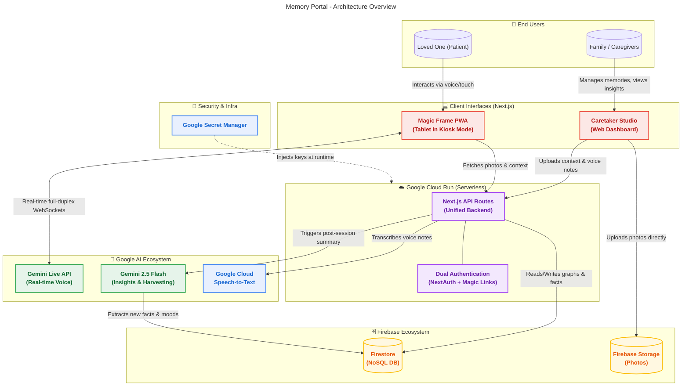

# System Architecture & Technology Stack

## Infrastructure Philosophy: 100% Serverless & Cloud-Native (GCP)
Memory Portal is designed from the ground up to be entirely serverless, running natively on Google Cloud Platform (GCP). This ensures zero infrastructure management, auto-scaling to zero to save costs, and seamless integration with the Google AI ecosystem.

## Technology Stack

| Component | Purpose |
| :--- | :--- |
| **Next.js (App Router)** | The core framework powering both the Caretaker Portal and Patient Magic Frame PWA, operating as a unified full-stack application. |
| **Google Cloud Run** | Serverless container hosting for the Next.js App. |
| **Firebase Storage** | Direct blob storage for user-uploaded photos, replacing complex Google Photos API integrations for a more streamlined, closed-loop system. |
| **Firebase / Firestore** | Serverless NoSQL database. Stores memories, the Family Knowledge Graph, patient profiles, and harvested insights. |
| **NextAuth.js (Google OAuth)** | Secure login for the Caretaker Portal. |
| **Gemini Live API** | Low-latency, real-time interruptible Conversational Engine. Connected directly via WebSockets (`v1beta`, `gemini-2.5-flash-native-audio-latest`). |
| **Gemini Pro API** | Post-session processing to extract "Harvested Memories" from conversation transcripts. |
| **Google Cloud Speech-to-Text** | Transcribes family voice notes for AI context. |

## Dual-Authentication Architecture (Security)

Because the system serves two entirely different user contexts from the same backend APIs, it implements a **Dual-Authentication Strategy** via a unified `isAuthorized` middleware:

1.  **Caretaker Studio (Human Authenticated):**
    *   Protected by **NextAuth.js (Google OAuth)**.
    *   Session cookies validate the caregiver to allow uploading photos, recording voice anchors, and editing the Family Knowledge Graph.
2.  **Magic Frame (Device Authenticated):**
    *   The patient device cannot use standard login flows.
    *   Protected by a **Device Token (Magic Link)**.
    *   The Caregiver logs into the Caretaker Studio and generates a secure link (`/frame?token=xyz`) from a protected backend API. The Magic Frame app consumes this token, saves it to `localStorage`, and strips it from the URL.
    *   The Frame attaches this token as a `Bearer` token on all API requests (fetching photos, sending harvest transcripts).
    *   *Note: The Gemini API Key is never exposed to the frontend. The Frame requests the key securely from the backend before establishing its WebSocket connection.*

## Codebase Architecture

The application follows a monolithic Next.js App Router structure:

*   `/src/app/studio`: The Caretaker Portal UI. Handles uploads, queue management, manual and voice context entry, inline memory editing, deletion, and Family Graph CRUD operations.
*   `/src/app/frame`: The Magic Frame PWA. Full-screen, NoSleep-enabled React application managing the ambient display (prioritizing newest unshown photos) and interactive Voice Activity Detection (VAD) states.
*   `/src/hooks/useGeminiLive.ts`: The core conversational engine. Manages WebSockets, raw PCM audio capture/playback, client-side VAD (loudness debouncing), and Tool Calling responses (`changePhoto`, `endSession`). It leverages semantic understanding to map conversational entities (like family member names) to available photo contexts.
*   `/src/app/api/...`: Next.js Route Handlers.
    *   `/upload-photo`, `/upload-voice`, & `/upload-text`: Secure endpoints writing to Firebase Storage, managing context, and triggering GCP Speech-to-Text.
    *   `/family-graph` & `/patient`: CRUD for the context graph. Secured by Dual-Auth.
    *   `/harvest`: Receives transcripts, prompts Gemini 2.5 Flash for facts, and writes directly back to the specific memory's `learnedFacts` array.
    *   `/gemini-key`: Secure endpoint to deliver the Gemini API key to authorized frontend clients, preventing bundle exposure.
    *   `/frame-setup`: Secure endpoint generating connection tokens for Magic Frames.

## ✨ The "Wow" Factor: Platform Features

Memory Portal isn't just a technical achievement; it's designed to create magical, emotional moments. Here is what makes the platform truly special:

*   **Interactive "Magic" Frame:** It's not just a passive digital photo album. With a single tap of "Reminisce," the ambient display transforms into a deeply engaging, low-latency voice companion that knows the stories behind the pictures.
*   **Semantic Photo Surfacing (Tool Calling):** The AI actively listens! If a loved one mentions "fishing with John," the Gemini AI autonomously triggers a `changePhoto` tool to instantly bring up the fishing trip photo on the screen, creating a serendipitous and fluid experience.
*   **AI Memory Harvesting:** The system learns and remembers. After every chat, a background Gemini model quietly distills new facts and emotional insights from the transcript. It automatically builds a richer, long-term memory graph so the AI remembers what the loved one said for their next session.
*   **Actionable Caregiver Insights:** Families don't just get raw transcripts; they get peace of mind. The Caretaker Studio provides a beautiful dashboard summarizing their loved one's overall mood, current topics of fixation, and AI-driven suggestions for what specific photos to upload next to spark joy.
*   **Multi-Modal Family Vault:** Caregivers don't have to type long paragraphs. They can simply speak into their phones to drop voice notes on photos. This instantly anchors the image with deep, personal context (names, relationships, inside jokes) for the AI to use.
*   **Barge-In Ready & Empathetic:** The AI can be interrupted naturally. It stops, listens, and responds just like a human. Strict anti-hallucination and positivity guardrails guarantee every interaction is safe, grounded, and uplifting.
*   **Graceful Session Management:** The AI is trained to recognize conversational closing cues (e.g., "I'm tired," "goodbye") and will autonomously invoke an `endSession` tool to transition the frame back to its quiet, ambient state.

## ⚙️ Under the Hood: Technical Features

Memory Portal is engineered to meet the strict demands of real-time, interruptible AI while maintaining robust security and scalability.

*   **True Live Agent via WebSockets:** Powered directly by the Gemini Live WebSocket API (`gemini-2.5-flash-native-audio-latest`), ensuring the low-latency, full-duplex communication required for natural "barge-in" interruptions. 
*   **100% Serverless Cloud-Native:** The entire infrastructure—Next.js frontend/API, Firestore database, and Firebase Storage—is designed to run natively and auto-scale on Google Cloud Platform.
*   **Dual-Authentication Architecture:** Implements a strict security boundary using NextAuth.js (Google OAuth) for the Caretaker Studio, and secure, zero-trust, rotating Device Tokens (Magic Links) for the patient-facing Magic Frame.
*   **Chained AI Pipeline:** Uses a dual-model approach: Gemini Live API handles the real-time, low-latency conversation, while a secondary Gemini 2.5 Flash model runs asynchronously post-session to extract structured JSON data (Memory Harvesting and Insights).
*   **Seamless Transcriptions:** Integrated with Google Cloud Speech-to-Text to accurately transcribe caregiver voice notes into semantic context for the database.
*   **Zero-Surveillance Design:** The patient interface utilizes client-side Voice Activity Detection (VAD). Audio is only streamed to the API when sustained human speech is detected, and the camera is never accessed, ensuring absolute privacy.

## Architecture Diagram

## Security & Privacy Enhancements
*   **Zero-Surveillance Architecture**: The architecture relies entirely on WebSockets for audio. The patient device camera is never accessed.
*   **Client-Side VAD**: Audio is only streamed to Gemini when sustained human speech is detected, preventing constant ambient room recording.
*   **No Hardcoded Secrets**: Next.js environment variables are strictly server-side. The `NEXT_PUBLIC_` prefix is intentionally omitted for LLM API keys.
