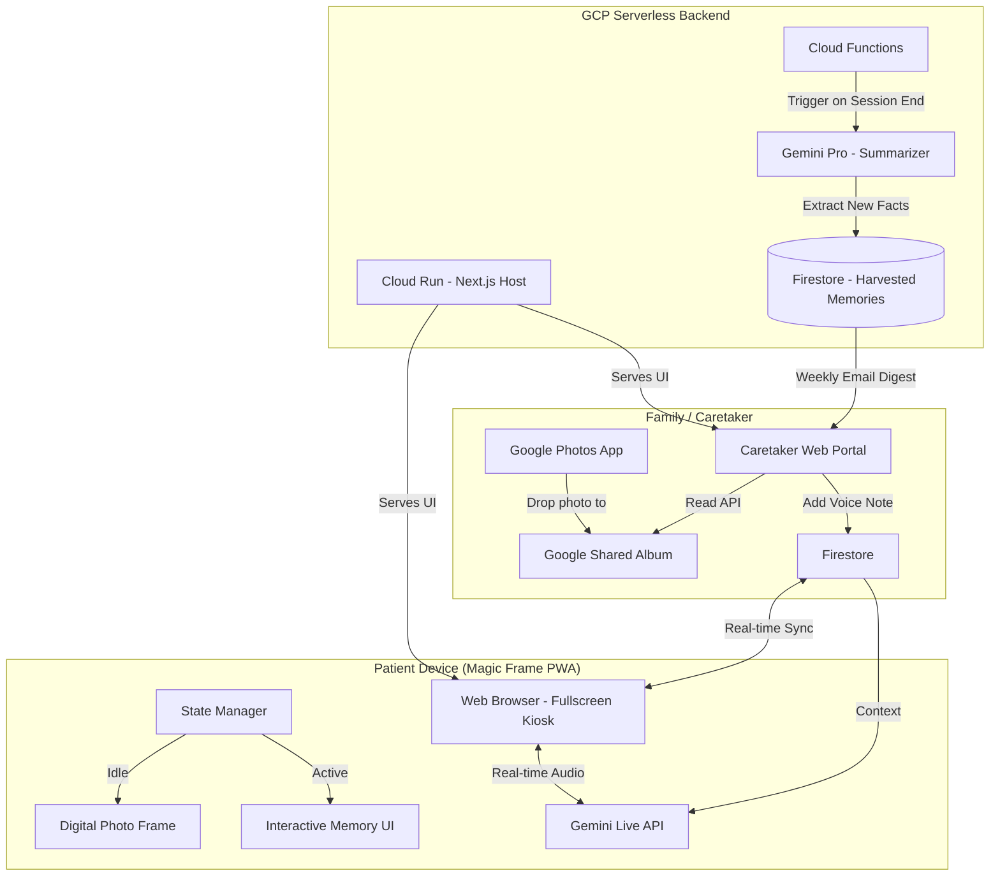

# System Architecture & Technology Stack

## Infrastructure Philosophy: 100% Serverless & Cloud-Native (GCP)
Memory Portal is designed from the ground up to be entirely serverless, running natively on Google Cloud Platform (GCP). This ensures zero infrastructure management, auto-scaling to zero to save costs, and seamless integration with the Google AI ecosystem.

## Technology Stack

| Component | Purpose |
| :--- | :--- |
| **Google Cloud Run** | Serverless container hosting for the Next.js App (powers both the Caretaker Portal and Patient PWA). |
| **Firebase / Firestore** | Serverless NoSQL database. Syncs real-time state between the Caretaker Studio and Patient PWA. |
| **Google Identity (OAuth)** | Secure login for the Caretaker Portal. |
| **Google Photos API** | Reads from a designated "Shared Album" for frictionless family photo curation. |
| **Gemini Live API** | Low-latency, real-time interruptible Conversational Engine. |
| **Gemini Pro API** | Post-session processing to extract "Harvested Memories". |
| **Google Cloud Speech-to-Text** | Transcribes family voice notes for AI context. |
| **Google Cloud Storage** | Serverless object storage for caching active photos or temporary audio files. |
| **Google Cloud Functions** | Serverless event-driven functions (e.g., triggering the Memory Harvest analysis after a session ends). |

## Architecture Diagram

## Security & Privacy Enhancements
*   **Scoped Access**: Google Photos API is granted read-only access strictly to a single, designated Shared Album, protecting the rest of the caregiver's library.
*   **The "Magic Frame" Sandbox**: The Patient PWA is a locked-down web interface. There are no external links, browsers, or complex menus.
*   **No Active Cameras**: The architecture relies entirely on Cloud APIs, WebSockets for audio, and Firebase for state syncing. The patient device camera is never accessed.
