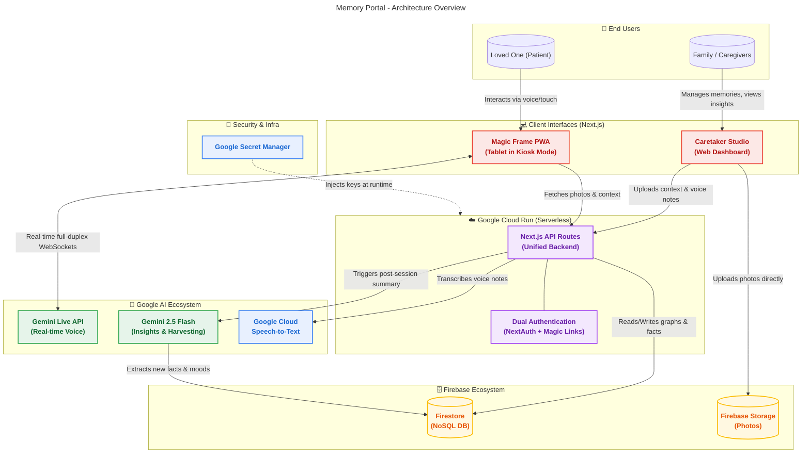

# 🧠 Memory Portal
### Bridging Generations with the Power of Gemini Live AI

[](https://nextjs.org/)
[](https://cloud.google.com/)
[](https://firebase.google.com/)
[](https://aistudio.google.com/)

> **A submission for the Google Gemini API Developer Competition**  
> **Category:** Live Agents  
> **Live Application:** [memory-portal-app.a.run.app](https://memory-portal-app-uqp246quja-uc.a.run.app)  
> **Demo Video:** https://www.youtube.com/watch?v=LbPNHtZ6dHA

---

---

## 🌻 The Human Touch: The Motivation Behind the Project

*The most painful part of memory loss isn't just forgetting the past. It's the quiet isolation it creates in the present.*

When a loved one experiences cognitive decline, looking at old photo albums can be a beautiful but lonely experience. Families want to be there 24/7 to guide those reminiscing sessions, to answer the same questions with infinite patience, and to bring those still images to life with the rich stories behind them, but they simply can't.

**Memory Portal is that bridge.**

> *"Memory is a muscle, and human connection is its fuel. Memory Portal was designed as a gentle 'gym for the mind', using AI not to replace human interaction, but to sustain it, helping our loved ones hold onto their family, their stories, and their sense of self for as long as possible."*

### How Gemini Brings It to Life

The system transforms an ordinary tablet into a **Magic Frame**. By day, it's an ambient digital photo frame prioritizing the newest memories uploaded by the family. 

But when the user taps "Reminisce", the magic happens. It awakens an empathetic, patient, and warm AI companion powered by the **Gemini Live API**. 

This isn't an AI that just "describes an image." It uses a deep **Family Knowledge Graph** and the personal stories recorded in the caregiver's own voice to engage in a fluid, real-time, voice-to-voice conversation. 
* **It exercises neural pathways** by gently encouraging active recall. 
* **It never corrects or shames**; if the patient gets confused, the AI gracefully pivots using *Errorless Learning* principles. 
* **It actively listens:** If a loved one mentions their grandson Mark, the Gemini Live agent autonomously uses its tool-calling capabilities to instantly bring up a photo of Mark on the screen. 

It acts as an infinitely patient co-pilot, ensuring the user is always exercising their memory in a safe, loving environment, while sending joyful updates back to the family about what they remembered today.

---

## ✨ The "Wow" Factor: Platform Features

Memory Portal goes beyond technical achievement; it is designed to create magical, emotional moments that bridge generations. 

**🖼️ The Interactive "Magic" Frame:** The project moves past the idea of a passive digital photo album. With a single tap of "Reminisce," the ambient display transforms into a deeply engaging, low-latency voice companion that *knows* the stories behind the pictures. It features a zero-friction interface with no typing and no logins, just natural conversation.

**🧠 Semantic Photo Surfacing (Tool Calling):** The AI actively listens to the flow of conversation. If a loved one mentions "fishing with John," the Gemini AI autonomously triggers a `changePhoto` tool. It instantly brings up the fishing trip photo on the screen, creating a serendipitous and fluid reminiscing experience.

**🌱 AI Memory Harvesting:** The system learns, grows, and remembers. After every chat, a background Gemini model quietly distills new facts and emotional insights from the transcript. It automatically builds a richer, long-term memory graph so the AI remembers what the loved one shared for their next session.

**💡 Actionable Caregiver Insights:** Families receive more than just raw transcripts; they get peace of mind. The Caretaker Studio provides a beautiful dashboard summarizing their loved one's overall mood, current topics of fixation, and AI-driven suggestions for what specific photos to upload next to spark joy.

**👨‍👩‍👧‍👦 Multi-Caregiver Support:** Caregiving is a team effort. The primary caregiver can seamlessly invite other family members via email to join the portal. Invited caregivers get secure access to upload photos, record stories, and view insights, ensuring the whole family can contribute to the Magic Frame experience.

**🎙️ Multi-Modal Family Vault:** Caregivers shouldn't have to type long paragraphs. They can simply speak into their phones to drop voice notes on photos, powered by GCP Speech-to-Text. This instantly anchors the image with deep, personal context like names, relationships, and inside jokes, for the AI to weave into conversation.

**🤝 Barge-In Ready & Empathetic:** The AI can be interrupted naturally. It stops, listens, and responds just like a human. Strict anti-hallucination and positivity guardrails guarantee every interaction is safe, grounded, and uplifting.

**👋 Graceful Session Management:** The AI is trained to recognize conversational closing cues, like "I'm tired" or "goodbye." It will autonomously invoke an `endSession` tool to naturally say farewell and transition the frame back to its quiet, ambient state.

---

## ⚙️ Under the Hood: Technical Features

Memory Portal is engineered to meet the strict demands of real-time, interruptible AI while maintaining robust security.

**⚡ True Live Agent via WebSockets:** The experience is powered directly through the Gemini Live WebSocket API (`gemini-2.5-flash-native-audio-latest`), ensuring the low-latency, full-duplex communication required for natural interruptions. 

**☁️ 100% Serverless Cloud-Native:** The entire infrastructure, including the Next.js frontend and API, Firestore database, and Firebase Storage, is designed to run natively and auto-scale on Google Cloud Platform, with a target deployment on Cloud Run.

**🔐 Dual-Authentication Architecture:** A strict security boundary is implemented using NextAuth.js and Google OAuth for the Caretaker Studio, combined with secure, zero-trust, rotating Device Tokens for the patient-facing Magic Frame.

**🤖 Chained AI Pipeline:** The system uses a dual-model approach. The Gemini Live API handles the real-time, low-latency conversation, while a secondary Gemini 2.5 Flash model runs asynchronously post-session to extract structured JSON data for Memory Harvesting and Insights.

**🎤 Seamless Transcriptions:** Google Cloud Speech-to-Text is integrated to accurately transcribe caregiver voice notes into semantic context for the database.

**🛡️ Zero-Surveillance Design:** The patient interface utilizes client-side Voice Activity Detection. Audio is only streamed to the API when sustained human speech is detected, and the camera is never accessed, ensuring absolute privacy.

---

## 🏗️ Architecture & Security

Memory Portal is a monolithic Next.js application built to run 100% Serverless on Google Cloud Platform. 

### 🕵️ For Judges: Where the AI Magic Happens
If you are evaluating this project for the Gemini API competition, here are the core files where the Gemini integration lives:
*   `web-app/src/hooks/useGeminiLive.ts`: The heart of the real-time agent. Handles the `v1beta` WebSocket connection, raw PCM audio streaming, Voice Activity Detection (VAD), and Tool Calling execution.
*   `web-app/src/app/api/harvest/route.ts`: Uses `gemini-2.5-flash` to extract structured JSON insights (new facts and emotional tone) from the live session transcripts.
*   `web-app/src/app/api/insights/route.ts`: Uses `gemini-2.5-flash` to analyze weeks of harvested data to generate actionable caregiving insights.



**Core Technologies:**
**Frontend & API:** Next.js (App Router)
**Real-time AI:** Gemini Live API (WebSocket)
**Post-processing AI:** Gemini Pro (REST)
**Transcription:** Google Cloud Speech-to-Text
**Database & Storage:** Firebase / Firestore & Firebase Storage
**Hosting:** Google Cloud Run (Target Deployment)

**Security First:**
Because the application deals with sensitive family data and vulnerable users, security is not an afterthought. It uses a **Dual-Authentication Strategy**:
1.  **Caregivers** authenticate via NextAuth.js (Google OAuth).
2.  **Magic Frames** use a secure, one-time device token generated from the Caretaker Studio.
3.  **Zero-Surveillance:** Audio is processed using client-side Voice Activity Detection (VAD). The microphone only sends data when human speech is occurring. Cameras are *never* accessed.
4.  **No Exposed Keys:** The Gemini API keys never touch the client bundle. They are securely injected via authenticated backend routes.

🔗 **[Read the Full System Architecture Document Here](./Plan/02_Architecture.md)**
🔗 **[Read about the specialized AI Persona & Rules Here](./Plan/09_AI_Persona.md)**

---

## 🧪 Reproducible Testing Instructions

To help judges experience the Magic Frame and the Caretaker Studio exactly as intended, follow these steps to test the live application.

### 1. Accessing the Caretaker Studio
1. Navigate to the live URL: [memory-portal-app-uqp246quja-uc.a.run.app](https://memory-portal-app-uqp246quja-uc.a.run.app)
2. Click **"Caretaker Login"**.
3. Authenticate using any Google Account. (The application uses NextAuth.js for secure OAuth).
4. Once logged in, you will see the Caretaker Dashboard. 
5. *Test the Flow:* Try uploading a new photo and typing a short context note (e.g., "This is me and my dog Buster").

### 2. Generating the Magic Frame Link
1. From the Caretaker Dashboard, locate the **"Generate Frame Link"** button.
2. Click it to generate a secure, one-time device token.
3. A unique URL will be generated. Copy this URL.

### 3. Experiencing the Magic Frame (Live Agent)
1. Open a **new Incognito/Private browsing window** (this simulates the separate physical tablet device the patient would use).
2. Paste the generated Frame Link into the URL bar.
3. The application will consume the token, authenticate the device, and strip the token from the URL.
4. You will see the ambient photo frame UI displaying the photos uploaded in Step 1.

### 4. Testing the Gemini Live Barge-In
1. Ensure your microphone is enabled and your speakers are on.
2. Click the **"Reminisce"** (or microphone) button on the screen.
3. **Wait for the AI to speak first.** It will greet you and describe the photo currently on screen using the context provided in Step 1.
4. **Test the Barge-In:** While the AI is speaking, interrupt it loudly. Say something completely off-topic, like *"Wait, I'm tired, I want to stop."*
5. Observe how the Gemini Live API immediately halts its audio output, processes your interruption, and gracefully handles the end-of-session intent using Tool Calling.

---

## ☁️ Google Cloud Deployment

This application is designed to be fully containerized and deployed to **Google Cloud Run** using Terraform. It uses **Google Secret Manager (GSM)** to manage all sensitive keys, ensuring they are never exposed in plaintext or committed to the repository.

### Quick Deploy (One-Click Update)

Once the initial infrastructure is set up, you can build, push, and deploy a new version of the app seamlessly using the included bash script:

```bash
./deploy.sh
```

This script will:
1. Extract your `NEXT_PUBLIC_` env variables for the Docker build.
2. Build the Docker image specifically for `linux/amd64` (Cloud Run's architecture) and tag it with your current git commit hash.
3. Push the image to Google Artifact Registry.
4. Auto-update the Terraform `terraform.tfvars` file with the newly built image tag.
5. Run `terraform apply -auto-approve` to seamlessly update the Cloud Run service.

### Infrastructure as Code (Terraform)

All Google Cloud resources are provisioned via Terraform in the `terraform/` directory.

🔗 **[Read the Full Deployment & Terraform Guide Here](./terraform/README.md)**

*Note on State Files:* Terraform state files (`*.tfstate`) are explicitly ignored in `.gitignore` to prevent leaking sensitive information if you are running Terraform locally. For a multi-developer team, consider configuring a GCS backend for remote state storage.

---

## 🏆 How Memory Portal Meets Judging Criteria

This project was built specifically for the **Live Agents** category of the Gemini API Developer Competition.

**1. Innovation & Multimodal UX (40%)**
- ✅ **Breaks the Text-Box Paradigm:** The Magic Frame has zero text inputs. It relies entirely on full-duplex voice and touch.
- ✅ **True "Live" Interruptibility:** Powered directly by the Gemini Live API (`gemini-2.5-flash-native-audio-latest`) via WebSockets, allowing the user to naturally "barge-in", change topics, or interrupt the AI with low-latency.
- ✅ **Tool Calling in Real-Time:** The AI listens to the context and autonomously triggers UI changes (e.g., pulling up a specific family photo when mentioned).

**2. Technical Implementation & Architecture (30%)**
- ✅ **Google GenAI SDK:** Uses the official `@google/genai` SDK for backend Memory Harvesting and Insights generation via `gemini-2.5-flash`.
- ✅ **Google Cloud Native:** 100% serverless on **Google Cloud Run**, using **Firestore**, **Cloud Storage**, **Google Cloud Speech-to-Text**, and **Secret Manager** (provisioned via included **Terraform**).
- ✅ **Strict Guardrails:** Employs "Errorless Learning" system instructions to prevent hallucinations and keep interactions positive and safe for vulnerable users.

**3. Core Competition Mandates**
- ✅ **Leverages a Gemini Model:** Yes (Live API + Flash).
- ✅ **Open Source Repository:** Publicly available with full deployment scripts.
- ✅ **Live Demo Video:** Includes real-time footage of the barge-in capabilities and multimodal interaction.

---

*Built with ❤️ for the Google Gemini API Developer Competition.*
